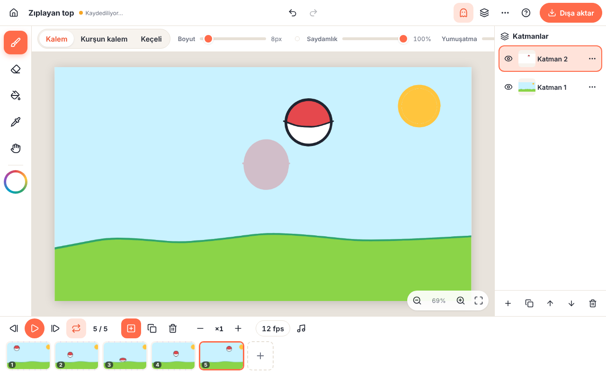
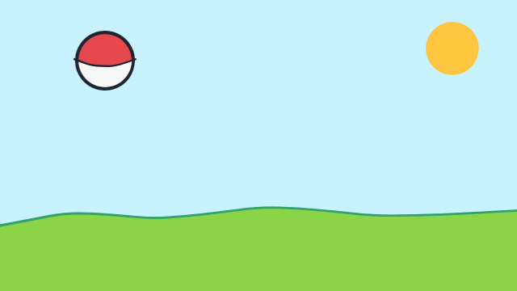

# Kare Kare

**Tablet ve kalemle çalışan, reklamsız, filigransız, internetsiz ve açık kaynak kare kare animasyon uygulaması.**
*A free, offline, open-source frame-by-frame animation app for tablets and pens — no ads, no watermark, no layer limits.*





> Kare Kare bir web uygulamasıdır (PWA): Chromebook, iPad, Android tablet veya bilgisayarda tarayıcıdan açılır, “Ana ekrana ekle / Uygulamayı yükle” ile kurulur ve sonra internetsiz çalışır. Çizimler yalnızca cihazda saklanır; hiçbir yere yüklenmez.

## Özellikler

- **Basınç duyarlı fırça** (Kalem / Kurşun kalem / Keçeli), silgi, renk seçici, ayarlanabilir yumuşatma
- **Boya kovası**: hassasiyet ayarı, “çizgi altına taşır” seçeneği (kenarlarda boşluk kalmaz) ve “tüm katmanlara bak” ile ayrı katmandaki çizgilere göre boyama
- **Sınırsız katman ve kare**: gizle/göster, kilitle, saydamlık, çoğalt, sırala
- **Onion skin**: önceki/sonraki kareler kırmızı/yeşil soluk görünür
- **Zaman çizelgesi**: kare küçük resimleri, basılı tutup sürükleyerek sıralama, kare tutma süresi (×2, ×3 …), FPS ayarı, döngülü oynatma
- **Ses parçası**: dalga formu karelerin altında, sürükleyerek kaydırma, kareler arasında gezerken sesi duyma (dudak senkronu)
- **Dışa aktarma — filigran yok**: GIF, MP4 (WebCodecs ile cihazda, sesli), PNG dizisi (.zip) veya tek PNG; paylaş menüsüyle doğrudan Fotoğraflar’a/uygulamalara gönderme
- **Otomatik kayıt** (OPFS) ve taşınabilir **proje dosyası (.zip)** içe/dışa aktarma
- **Tablet dostu**: Apple Pencil / kalem algılanınca parmak sadece kaydırır ve yakınlaştırır (avuç reddi), iki parmakla dokun = geri al, üç parmak = yinele, solak düzeni
- Türkçe ve İngilizce arayüz, karanlık mod

## Klavye kısayolları

| Eylem | Kısayol |
| --- | --- |
| Fırça / silgi / kova / renk seçici / el | `B` `E` `G` `I` `H` |
| Geri al / yinele | `Ctrl+Z` / `Ctrl+Shift+Z` |
| Önceki / sonraki kare | `←` `→` |
| Yeni kare / kareyi çoğalt | `N` / `D` |
| Oynat / duraklat | `Enter` |
| Fırça boyutu | `[` `]` |
| Onion skin | `O` |
| Tuvali kaydır | `Boşluk` + sürükle |

## Tarayıcı desteği

| | Çizim, katman, kayıt | GIF / PNG | MP4 |
| --- | --- | --- | --- |
| Chrome / Edge / Chromebook | ✅ | ✅ | ✅ |
| Safari (iPadOS / macOS 16.4+) | ✅ | ✅ | ✅ (sesin videoya eklenmesi sürüme bağlı) |
| Firefox | ✅ | ✅ | sürüme göre MP4, WebM veya yok |

> iPad’de Safari, ana ekrana eklenmemiş sitelerin verisini uzun süre kullanılmazsa silebilir. Kalıcı kullanım için **Paylaş → Ana Ekrana Ekle** ile kurun ve önemli projeleri arada bir **Proje dosyasını kaydet (.zip)** ile yedekleyin.

## Geliştirme

```bash
npm install
npm run dev        # http://localhost:5173
npm test           # birim testleri (vitest)
npm run build      # tip kontrolü + üretim derlemesi (dist/)
npm run preview    # derlemeyi yerelde sunar
```

Tarayıcı testleri (Playwright ile gerçek arayüz üzerinden çizim, dokunma hareketleri, ses ve dışa aktarma; `playwright` paketi ve Chromium gerekir):

```bash
npm run build && npm run preview &
node scripts/smoke.mjs          # çizim, kova, katman, geri al, oynat, dışa aktar, yeniden aç
node scripts/smoke-input.mjs    # kalem basıncı, avuç reddi, sıkıştır-yakınlaştır, 2/3 parmak, ses
node scripts/demo.mjs           # docs/screenshot.png ve docs/demo.gif üretir
```

### Yayınlama

`main` dalına her gönderimde GitHub Actions testleri çalıştırır, derler ve **GitHub Pages**’e yayınlar. İlk seferde depo ayarlarından **Settings → Pages → Source: GitHub Actions** seçilmelidir. Uygulama göreli yollarla derlendiği için herhangi bir statik sunucuda da çalışır.

## Mimari

- **TypeScript + Vite**, çerçeve yok; küçük bir DOM yardımcı katmanı (`src/ui`).
- **Hücre modeli**: her katman×kare bir *hücre*dir. Hücre pikselleri kırpılmış PNG olarak saklanır; çözülmüş görüntüler bellek bütçeli bir LRU önbellekte tutulur (`src/core/cellStore.ts`). Böylece yüzlerce kare iPad’in tuval belleği sınırına takılmaz.
- **Canlı tuval**: düzenlenen hücre tek bir tuvalde çizilir; alt/üst katmanlar ve onion skin ayrı tuvallerde birleşir, yakınlaştırma CSS dönüşümüyle yapılır.
- **Fırça**: [perfect-freehand](https://github.com/steveruizok/perfect-freehand) ile tüm vuruşun dış hattı her karede yeniden çizilir (vuruş içinde üst üste binme olmadan saydamlık).
- **Geri al**: değişen dikdörtgenin önce/sonra pikselleri saklanır; yapısal işlemler (kare/katman) komut olarak geri alınır.
- **Kayıt**: OPFS’e bir worker üzerinden (`createSyncAccessHandle`) yazılır. İki dönüşümlü manifest (`project-a/b.json`) sayesinde yazma sırasında çökme olsa bile bir önceki tutarlı sürüm kalır.
- **Dışa aktarma** bir worker’da yapılır: GIF için [gifenc](https://github.com/mattdesl/gifenc), video için WebCodecs + [Mediabunny](https://github.com/Vanilagy/mediabunny), zip için [fflate](https://github.com/101arrowz/fflate).

```
src/
  model/     veri tipleri, zaman çizelgesi hesapları
  core/      fırça, kova dolgu, hücre önbelleği, geri al, PNG kodlayıcı worker
  editor/    editör ekranı: sahne, araçlar, katmanlar, zaman çizelgesi, oynatıcı, dışa aktarma
  storage/   OPFS, proje deposu, .zip proje dosyası
  export/    GIF / MP4 / PNG dışa aktarma worker’ı
  audio/     ses çözme, dalga formu, oynatma
  home/      proje galerisi
  i18n/      Türkçe ve İngilizce metinler
```

## Gizlilik

Kare Kare hiçbir sunucuya veri göndermez, hesap gerektirmez, reklam veya izleme içermez.

## Lisans

[MIT](LICENSE). Kullanılan kütüphaneler: perfect-freehand (MIT), gifenc (MIT), fflate (MIT), Mediabunny (MPL-2.0), Lucide ikonları (ISC).

---

## English

Kare Kare is a frame-by-frame animation PWA built for kids, students and anyone who wants a FlipaClip-style tool without layer limits, watermarks or ads. It runs entirely in the browser, installs to the home screen and works offline.

**Features:** pressure-sensitive brushes, eraser, fill bucket with tolerance and gap-hiding, color picker, unlimited layers and frames, onion skin, frame holds, drag-to-reorder timeline, adjustable FPS, a sound track with waveform and scrubbing for lip-sync, GIF / MP4 / PNG-sequence export with no watermark, autosave to the Origin Private File System and portable `.zip` project files. Palm rejection once a stylus is detected, two-finger tap to undo, three-finger tap to redo, pinch to zoom, left-handed layout, Turkish and English UI.

Run `npm install && npm run dev` to start developing; see the Turkish sections above for scripts, architecture and deployment (GitHub Pages via Actions).
